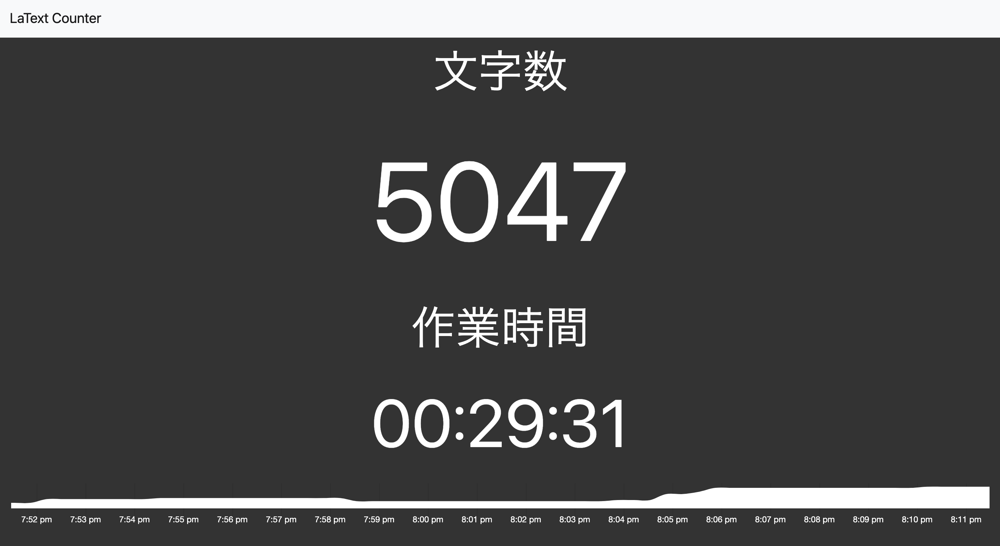

# latext-counter
LaTeXの文字数をカウントして表示するWebアプリケーション



```
$ npx latext-counter -h
Usage: latext-counter [options]

A command line tool for count latter of LaTex file.
This application requires texcount command.

Options:
  -V, --version      output the version number
  -p, --port [port]  port (default: "3000")
  -f, --file <path>   LaTex file path (default: "./main.tex")
  -h, --help         output usage information
```